[(Static GitHub Link)](https://github.com/VictorFajardo/goodbye-email-for-wunderman)
# Dear Wundercitizens... #

When I started writing this email, I had in mind to do it in the most professional way; but I have a reputation to uphold (and just a couple of hours before my account will be deactivated), so here we go 🧐

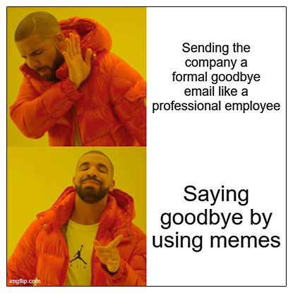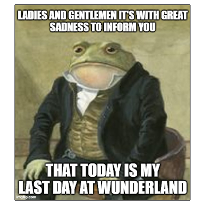

As some of you have heard already, today is my last day at Wunderman Thompson. (For those of you who don’t know me, I’m a **Señor** Web Developer) 👨‍💻

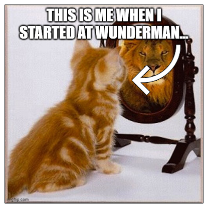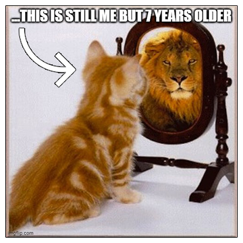

After more than 7 years, I’m leaving WTH to pursue an Software Engineer opportunity in a Tech Giant. I want to thank everyone for their friendship and support. ¡Los extrañaré a todos! 😢

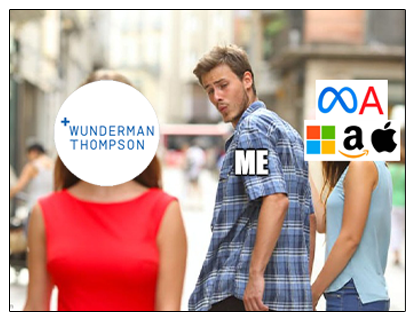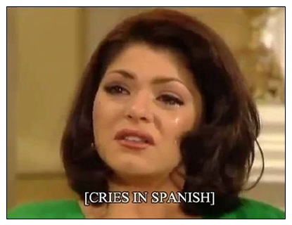

It’s been an incredibly educational experience in almost every way. I’ve met and worked with many talented people, too many to name. ¡Muchas gracias por todo 👏

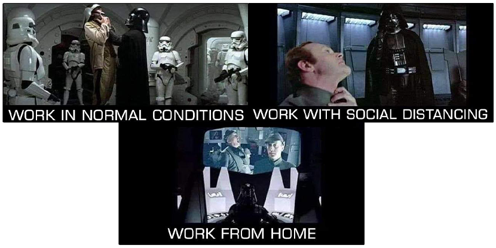

(*Graphical representation of me **totally not using** Sith Lord's force choke to win agreements at work* 😉) 

Of course, I have to send a special shout-out to the Creative department and the BI team 😉

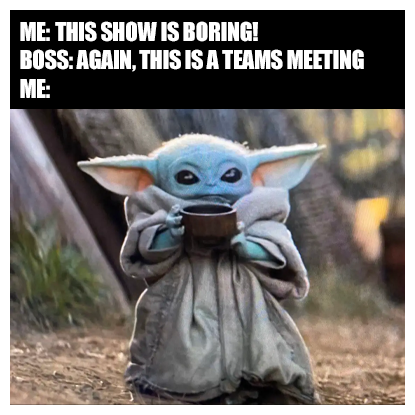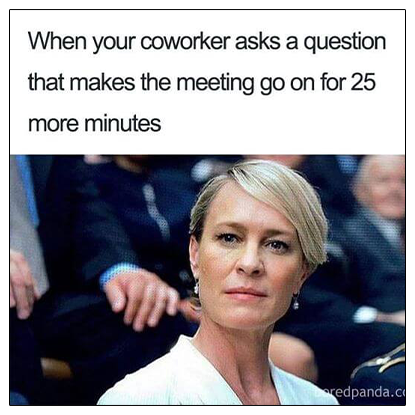

And for 7+ years of deleyed timesheets... thanks to the Finance Department for all the patience! 😅

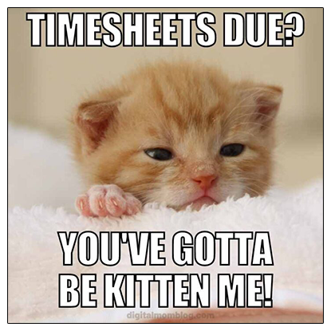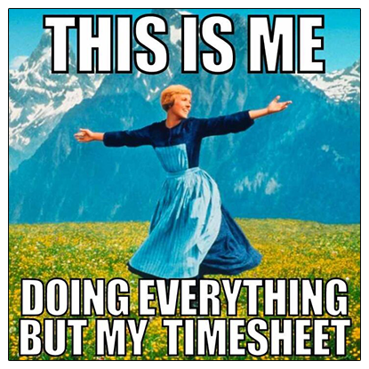

I would LOVE to stay in touch with anybody who is willing to do so.  I have my personal e-mail address, cell phone number, and social media links below 🙋‍♂️

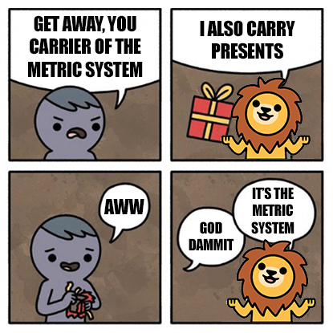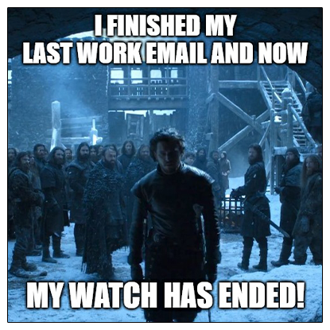

Lastly, I wish good fortune to everyone, I hope our paths will cross in the future. Keep being a rock star! 🤘

**Sorry for the long email, here's a potato** 🥔

[Bonus picture] My Wunderpet: *Lady **Éowyn** (of Rohan)*

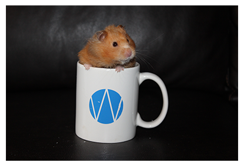

Personal e-mail: xxx@xxx.com\
Cell phone number: xxx-xxx-xxxx

Social media links:\
   

**Victor Fajardo**\
Meme Advocate, Metric System Champion, and Occasionally Senior Web Developer\
**Wunderman Thompson**

